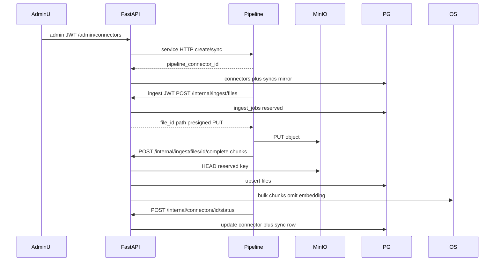

# Internal ingest API and connector control plane

**Implemented.** Product truth is `prompt_2/current.md`. This file is the plan record. The ship dump is `prompt_2/internal_ingest_log.md`. Do not treat the checklist as open work. `prompts/` is frozen — do not edit it.

**Where this file lives.** `prompt_2/` is agent memory. This plan is a sibling of `current.md`, same pattern as `prompt_2/frontend_ui_plan.md`. The frozen Airbyte/Kafka/Spark proposal stays at `prompts/cursor_summary/12_ingestion_pipeline_proposal.md` and is not this slice.

**Authority when documents disagree.**

1. `prompt_2/current.md` sections Now, Not yet, and Invariants.
2. This plan (for the unbuilt `/internal` + connector control plane).
3. The pass file for the pass in progress (`prompt_2/internal_ingest/`). A pass file may spell out request shapes and file paths. It does not override the locks in this plan.
4. `prompt_2/context/connectors.md` and the frozen proposal (background only).

**Implementation passes.** Work these in order. Do not start the next pass until that file's test gate passes. These files are plans, not shipped work.

| Pass | File | Covers |
| --- | --- | --- |
| 1 | `prompt_2/internal_ingest/pass_1_auth_schema.md` | T1, T2 |
| 2 | `prompt_2/internal_ingest/pass_2_file_ingest.md` | T3, T4 |
| 3 | `prompt_2/internal_ingest/pass_3_connectors_stats.md` | T5, T6 |
| 4 | `prompt_2/internal_ingest/pass_4_ui_proofs_docs.md` | T7, T8, T9 |

---

## 0. Human locks

| Lock | Decision |
| --- | --- |
| Slice | Full control plane: admin APIs + Configuration UI + outbound HTTP to a pipeline base URL + `/internal` status callbacks. |
| MinIO | Backend reserve returns a short-lived **presigned PUT**. Pipeline never gets MinIO root credentials. |
| Pipeline service | **Not built in this repo.** Typed client + documented contract. Empty URL → 503. Unreachable / non-2xx → 502. |
| File write | Two `/internal` steps (reserve, then complete). Pipeline writes bytes to MinIO; pipeline supplies chunks. |
| Connectors | Pipeline owns connectors. This backend is BFF + Postgres mirror. SPA never calls the pipeline. |

**Do not**

- Invent a Task 7 `files_writer` cutover.
- Auto-grant `file_acl`.
- Forward the ingest JWT to OpenSearch, or search as basic `admin`.
- Reuse `/files/uploads` or `api-client` Keycloak-admin credentials for ingest.
- Persist source passwords in this database.
- Edit `prompts/`.

---

## 1. Auth

New confidential Keycloak client `ingest-client` (service accounts on, direct access grants off, no PKCE). Realm role `ingest-service` only — not `admin`, not `search-user`, not realm-management.

Token must include `aud=api-client` (same audience mapper as `docker_service_configs/keycloak/realm.json`) so existing `decode_access_token` in `backend/app/core/security.py` keeps working.

Add `require_ingest_service` in `backend/app/api/deps.py`. `/internal/*` uses only that. Product users and realm `admin` get 403 on those routes.

Init: extend `backend/init_services/keycloak.py` (`CLIENT_IDS` today is only `api-client` / `web-client`) and add the client to `realm.json` for fresh imports. Persist `KEYCLOAK_INGEST_SECRET` in `.env`. Identity sync will create a users row for the service account — do not grant it product roles or `file_acl`.

OpenSearch writes stay basic `admin` inside FastAPI (`backend/app/services/opensearch_ingest.py`). Do not map `ingest-service` to `files_searcher` or `files_writer`.

---

## 2. File ingest: two `/internal` steps (not three)

Do **not** insert a live `files` row on reserve (`object_store_path` is `NOT NULL` unique; View/Open would 404). Do **not** add a backend byte-upload route.

### `POST /internal/ingest/files` (`require_ingest_service`)

- Body: `filename`, `size_bytes`, `ingestion_type`, `original_source` (required, stable source URI), optional `content_type`.
- Upsert by `(ingestion_type, original_source)`: reuse existing `file_id` on re-sync so `file_acl` survives.
- Allocate `file_id`, set `object_store_path` to `files/{ingestion_type}/{file_id}/{safe_name}` (keep `local/{file_id}/...` for HTTP upload only).
- Insert/update `ingest_jobs` status `reserved` (not `files`).
- Return `file_id`, `object_store_path`, `upload_url` (presigned PUT), `expires_at`.

Presign: add `presigned_put_url` on `MinioStore` (`backend/app/services/minio_store.py`) via MinIO `presigned_put_object`. New setting `minio_presign_endpoint` (compose-internal host, e.g. `minio:9000`) so the pipeline can reach the URL; FastAPI itself can keep `minio_endpoint=localhost:9000`. Default expiry 1 hour. Pipeline max size: new setting (default 100 MiB), independent of the 25 MiB human upload cap.

### `POST /internal/ingest/files/{id}/complete`

- Body: `size_bytes`, `file_type` (extension string; pipeline owns extraction — do not reuse `detect.py` pdf/txt/csv-only allowlist), `chunks: [{seq, content}]`.
- `HEAD` the reserved object; 409/422 if missing or size mismatch.
- Upsert `files` with that `file_id`. Parameterize `build_chunk_document` (today hardcodes `ingestion_type: "local"`).
- Bulk index: omit `embedding`; `chunk_id` = `{file_id}:{seq:06d}`; first write `allowed_* = []`; **re-index reloads names from `file_acl`**.
- Compensate like `compensate_local_ingest`: drop OS docs and the `files` row on failure; job → `failed`. Leave the MinIO object for retry.
- 409 if already `completed` with same size (idempotent retry).

Reject: client-supplied `file_id` on create, `allowed_*`, `embedding`, `lake/` prefixes, `object_store_path` override.

Leave `/files/uploads` and the folder CLI unchanged.

---

## 3. Schema (Alembic, revises `c3d4e5f6a7b8`)

- Widen `ck_files_ingestion_type` to `local` plus catalog types (`sharepoint`, `google_drive`, `s3`, `postgresql`, `oracle`, `sqlserver`, `salesforce`, `azure`, `gcs`, `email`, `box`, `sap`) plus `pipeline`.
- Partial unique `(ingestion_type, original_source) WHERE original_source IS NOT NULL`.
- `ingest_jobs`: `id`, `file_id`, reserved path, type/source/filename/size, `status` (`reserved|completed|failed|expired`), timestamps, optional error.
- `connectors`: `id`, `type`, `name`, `enabled`, `schedule`, `pipeline_connector_id`, `status` (`pending|idle|syncing|success|failed`), `last_sync_at`, `last_error`, timestamps. Do not persist source passwords — forward once, omit from GET.
- `connector_syncs`: `id`, `connector_id`, `status`, `started_at`, `finished_at`, `files_count`, `error`.

---

## 4. Connector control plane

Pipeline owns connectors. This backend is the BFF + Postgres mirror. The SPA never calls the pipeline.

**Admin** (`require_admin`) — new router `backend/app/api/routes/admin_connectors.py`:

- `GET/POST /admin/connectors`
- `GET/PATCH /admin/connectors/{id}`
- `POST /admin/connectors/{id}/sync`
- `GET /admin/connectors/{id}/syncs`

Outbound typed client (settings `ingestion_pipeline_url`, timeout). Empty URL → 503. Unreachable / non-2xx → 502. Documented pipeline contract (not implemented here): `POST/PATCH /connectors`, `POST /connectors/{pipeline_id}/sync`. Store `pipeline_connector_id` on success. If pipeline create fails, do not leave a successful local row.

**Internal callback** (`require_ingest_service`): `POST /internal/connectors/{id}/status` with `status`, `files_count`, `error`, timestamps. Updates `connectors` + the open `connector_syncs` row.

`GET /admin/stats`: live `active_connectors` = count `enabled`; `ingestion_rate_docs_per_hour` = `ingest_jobs` completed in the last hour (or non-`local` `files.updated_at`); `last_sync` = latest `connectors.last_sync_at` as ISO-8601 (or `null` / `—` if none). Set `placeholders.*` **false**. Update `backend/scripts/admin_stats_proof.py` (it currently asserts `8` / `12400` / `"2 min ago"`).

---

## 5. Frontend

Replace local fixtures in `frontend/src/components/config/IngestionSection.tsx`. Keep `CONNECTOR_CATALOG` in `frontend/src/config/placeholders.ts` as the form schema only. Add `frontend/src/api/connectors.ts` using existing `frontend/src/api/client.ts` helpers. List/enable/configure/sync-now hit `/admin/connectors*`. Dashboard cards already read stats — they go live when placeholders flip.

Verify in the browser: Configuration list, add, save, Sync Now, error when pipeline is down (502/503), Dashboard connector/rate/last-sync without Placeholder badges.

---

## 6. Tasks

Ordered for a single stream after this plan is locked.

- [x] T1. Keycloak `ingest-client` + realm role `ingest-service` (`realm.json` + `init_services`), `require_ingest_service`, `KEYCLOAK_INGEST_SECRET`, audience mapper `aud=api-client`.
- [x] T2. Alembic: widen `ingestion_type`, partial unique `(ingestion_type, original_source)`, tables `ingest_jobs`, `connectors`, `connector_syncs`.
- [x] T3. `POST /internal/ingest/files` — reserve job, path `files/{type}/{file_id}/{name}`, presigned PUT (`minio_presign_endpoint`).
- [x] T4. `POST /internal/ingest/files/{id}/complete` — HEAD MinIO, upsert `files`, parameterize chunk docs, bulk OS (omit embedding), compensate, reload `allowed_*` on re-index.
- [x] T5. Admin connector routes + outbound pipeline client (503 if URL empty, 502 if down) + `POST /internal/connectors/{id}/status`.
- [x] T6. Live `GET /admin/stats` from the new tables; flip `placeholders.*` to false; update stats proof.
- [x] T7. Configuration UI wired to `/admin/connectors`; catalog stays form schema only.
- [x] T8. Proofs: `backend/scripts/internal_ingest_proof.py` (client_credentials reserve → presign PUT → complete → PG/MinIO/OS, empty ACL, re-complete keeps `file_id` and reloads ACL); connector admin proof (create 502 if pipeline down; callback updates status).
- [x] T9. After code ships: update `prompt_2/current.md`, root `README.md`, and context notes `auth.md`, `ingest.md`, `dashboard.md`, `connectors.md`. Mark this plan `implemented`.

---

## 7. Out of this repo

Airbyte, Kafka, Tika, Spark, pipeline Dockerfile, source OAuth, auto-ACL, content-hash dedup, Task 7 `SKIP LOCKED` / `files_writer` mapping.

---

## Changelog

| Date | Change |
| --- | --- |
| 28 Sep 2026 | Initial plan from human locks: full control plane + presigned PUT. |
| 28 Sep 2026 | Split implementation into four pass plans under `prompt_2/internal_ingest/`. Not started. |
| 28 Sep 2026 | Pass 1 gate passed: `ingest-client`, `ingest-service`, Alembic `d4e5f6a7b8c9`. Record and test script in `prompt_2/internal_ingest/pass_1_auth_schema.md`. Product truth still waits for pass 4. |
| 28 Sep 2026 | Pass 2 gate passed: reserve and complete under `/internal/ingest/files`. Proof is the file half of `backend/scripts/internal_ingest_proof.py`. Detail in `prompt_2/internal_ingest/pass_2_reference.md`. Product truth still waits for pass 4. |
| 28 Sep 2026 | Pass 3 gate passed: admin connector routes, status callback, and live stats. Detail in `prompt_2/internal_ingest/pass_3_reference.md`. Product truth still waits for pass 4. |
| 28 Sep 2026 | Pass 4 implemented: Configuration ingestion calls `/admin/connectors`. Proofs green. Product truth is `prompt_2/current.md`. Ship dump is `prompt_2/internal_ingest_log.md`. |
